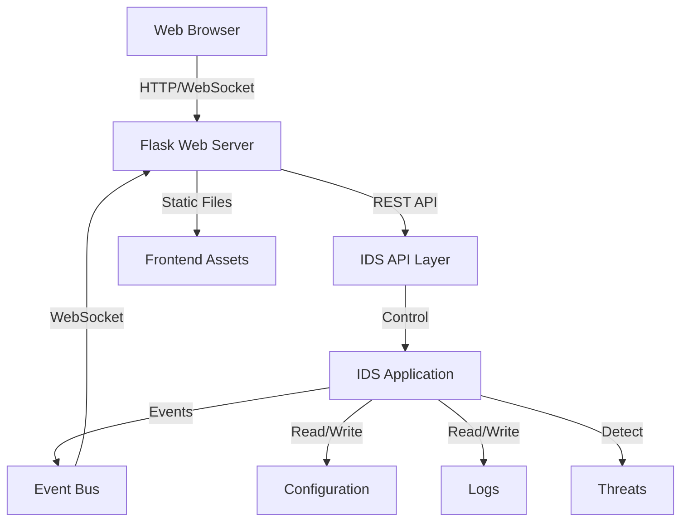

# IDS Web UI - Design Document

## Overview

The IDS Web UI is a modern, responsive web application that provides a comprehensive interface for managing and monitoring the Intrusion Detection System. Built with Flask (backend) and vanilla JavaScript with Bootstrap (frontend), the UI offers real-time threat monitoring, system configuration, analytics, and complete control over all IDS features. The architecture uses WebSocket for real-time updates and RESTful API for configuration and control operations.

## Architecture

### High-Level Architecture



### Component Architecture

The system is organized into the following layers:

1. **Frontend Layer**: HTML/CSS/JavaScript with Bootstrap for UI
2. **Web Server Layer**: Flask application serving API and WebSocket
3. **API Layer**: RESTful endpoints for IDS control and configuration
4. **Integration Layer**: Bridge between web server and existing IDS
5. **Event Layer**: Real-time event broadcasting via WebSocket

## Components and Interfaces

### 1. Frontend Application

**Responsibility**: Provide user interface for all IDS features

**Key Pages/Views**:
- **Dashboard**: Real-time monitoring, statistics, system status
- **Threats**: List of detected threats with filtering and details
- **Analytics**: Charts and statistics about threats over time
- **Configuration**: System settings management
- **Logs**: System logs and audit trail viewer
- **Notifications**: Email notification settings and history

**Technology Stack**:
- HTML5/CSS3
- Bootstrap 5 for responsive design
- Vanilla JavaScript (no framework required for simplicity)
- Chart.js for analytics visualization
- Socket.IO client for WebSocket connection

**Key Features**:
- Responsive design (desktop and tablet)
- Real-time updates without page refresh
- Color-coded severity indicators
- Interactive charts and graphs
- Form validation

### 2. Flask Web Server

**Responsibility**: Serve web application and provide API endpoints

**Key Components**:
- `app.py`: Main Flask application
- `routes/`: API route handlers
- `websocket.py`: WebSocket event handling
- `static/`: CSS, JavaScript, images
- `templates/`: HTML templates

**API Endpoints**:

```python
# System Control
GET  /api/status              # Get IDS status
POST /api/start               # Start monitoring
POST /api/stop                # Stop monitoring
POST /api/restart             # Restart IDS

# Threats
GET  /api/threats             # Get all threats (with filters)
GET  /api/threats/<id>        # Get threat details
GET  /api/threats/stats       # Get threat statistics

# Configuration
GET  /api/config              # Get current configuration
PUT  /api/config              # Update configuration
POST /api/config/test-email   # Send test email

# Detectors
GET  /api/detectors           # Get all detectors status
PUT  /api/detectors/<name>    # Enable/disable detector

# Logs
GET  /api/logs                # Get logs (with pagination)
GET  /api/logs/search         # Search logs

# Notifications
GET  /api/notifications       # Get notification history
PUT  /api/notifications/settings  # Update notification settings

# Analytics
GET  /api/analytics/summary   # Get analytics summary
GET  /api/analytics/timeline  # Get threat timeline data
```

**WebSocket Events**:
```python
# Server to Client
'threat_detected'     # New threat detected
'status_changed'      # IDS status changed
'stats_updated'       # Statistics updated
'notification_sent'   # Notification sent

# Client to Server
'connect'             # Client connected
'disconnect'          # Client disconnected
```

### 3. IDS API Layer

**Responsibility**: Bridge between web server and IDS application

**Key Classes**:

```python
class IDSController:
    """
    Controller for IDS operations.
    Provides high-level interface for web server to control IDS.
    """
    def __init__(self, ids_app: IDSApplication):
        self.ids_app = ids_app
        self.event_bus = EventBus()
    
    def start_monitoring(self) -> dict
    def stop_monitoring(self) -> dict
    def get_status(self) -> dict
    def get_threats(self, filters: dict) -> list
    def get_statistics(self) -> dict
    def update_configuration(self, config: dict) -> bool
    def get_logs(self, filters: dict) -> list
    def toggle_detector(self, detector_name: str, enabled: bool) -> bool
```

```python
class EventBus:
    """
    Event bus for broadcasting IDS events to WebSocket clients.
    """
    def __init__(self):
        self.subscribers = []
    
    def subscribe(self, callback: callable) -> None
    def publish(self, event_type: str, data: dict) -> None
    def on_threat_detected(self, threat_analysis: ThreatAnalysis) -> None
    def on_status_changed(self, status: str) -> None
```

```python
class ThreatStore:
    """
    In-memory store for detected threats with persistence.
    """
    def __init__(self, max_threats: int = 1000):
        self.threats = []
        self.max_threats = max_threats
    
    def add_threat(self, threat_analysis: ThreatAnalysis) -> None
    def get_threats(self, filters: dict) -> list
    def get_threat_by_id(self, threat_id: str) -> ThreatAnalysis
    def get_statistics(self) -> dict
    def clear_old_threats(self) -> None
```

### 4. Modified IDS Application

**Responsibility**: Integrate with web UI while maintaining existing functionality

**Modifications Needed**:

```python
class IDSApplication:
    """
    Enhanced IDS Application with web UI integration.
    """
    def __init__(self, config_path: str, event_bus: EventBus = None):
        # Existing initialization
        self.event_bus = event_bus
        self.threat_store = ThreatStore()
    
    # New methods for web UI
    def get_current_status(self) -> dict:
        """Get current IDS status for web UI"""
        return {
            'running': self._running,
            'interface': self.config_manager.get('detection.network_interface'),
            'uptime': self._get_uptime(),
            'packet_count': self.detection_engine.get_statistics()['packets_analyzed'],
            'threat_count': self.detection_engine.get_statistics()['threats_detected']
        }
    
    def start_monitoring_async(self) -> None:
        """Start monitoring in background thread"""
        pass
    
    def get_detector_status(self) -> list:
        """Get status of all detectors"""
        pass
    
    def toggle_detector(self, detector_name: str, enabled: bool) -> bool:
        """Enable or disable a specific detector"""
        pass
    
    # Modified run method to emit events
    def run(self) -> None:
        # ... existing code ...
        if threat_event:
            threat_analysis = self.threat_analyzer.analyze(threat_event)
            self.logger.log_threat(threat_analysis)
            self.notification_service.notify(threat_analysis)
            
            # NEW: Store threat and emit event
            self.threat_store.add_threat(threat_analysis)
            if self.event_bus:
                self.event_bus.on_threat_detected(threat_analysis)
```

## Data Models

### Frontend Data Models

```javascript
// Threat object
const threat = {
    id: 'uuid',
    timestamp: '2025-10-15T14:30:00Z',
    type: 'port_scan',
    severity: 'high',
    source_ip: '192.168.1.100',
    destination_ip: '10.0.0.5',
    protocol: 'TCP',
    description: 'Port scan detected...',
    recommendations: ['Block IP...', 'Review firewall...'],
    justification: 'Multiple ports scanned...'
};

// System status
const status = {
    running: true,
    interface: 'eth0',
    uptime: 3600,
    packet_count: 15000,
    threat_count: 5
};

// Statistics
const stats = {
    total_threats: 25,
    by_severity: {
        critical: 2,
        high: 5,
        medium: 10,
        low: 8
    },
    by_type: {
        port_scan: 10,
        icmp_scan: 5,
        malware: 3,
        brute_force: 4,
        attacker_identified: 2,
        data_exfiltration: 1
    },
    top_attackers: [
        {ip: '192.168.1.100', count: 5},
        {ip: '10.0.0.50', count: 3}
    ]
};
```

### Backend Data Models

```python
@dataclass
class ThreatDTO:
    """Data Transfer Object for threats"""
    id: str
    timestamp: str
    type: str
    severity: str
    source_ip: str
    destination_ip: Optional[str]
    protocol: str
    description: str
    recommendations: List[str]
    justification: str
    raw_data: dict
    
    @staticmethod
    def from_threat_analysis(analysis: ThreatAnalysis) -> 'ThreatDTO':
        """Convert ThreatAnalysis to DTO"""
        pass
    
    def to_dict(self) -> dict:
        """Convert to dictionary for JSON serialization"""
        pass
```

## User Interface Design

### Dashboard Page

**Layout**:
```
+--------------------------------------------------+
| Header: IDS Dashboard                    [User]  |
+--------------------------------------------------+
| [Dashboard] [Threats] [Analytics] [Config] [Logs]|
+--------------------------------------------------+
|                                                   |
| System Status                                     |
| +---------------------------------------------+   |
| | Status: ● ACTIVE    Interface: eth0        |   |
| | Uptime: 2h 15m      Packets: 15,234        |   |
| | [Stop Monitoring]                          |   |
| +---------------------------------------------+   |
|                                                   |
| Quick Stats                                       |
| +----------+ +----------+ +----------+ +--------+ |
| | Critical | |   High   | |  Medium  | |  Low   | |
| |    2     | |    5     | |    10    | |   8    | |
| +----------+ +----------+ +----------+ +--------+ |
|                                                   |
| Recent Threats                                    |
| +---------------------------------------------+   |
| | [CRITICAL] Malware Detected                 |   |
| | 192.168.1.100 → 10.0.0.5  |  14:30:25      |   |
| +---------------------------------------------+   |
| | [HIGH] Port Scan Detected                   |   |
| | 192.168.1.101 → 10.0.0.5  |  14:28:15      |   |
| +---------------------------------------------+   |
|                                                   |
+--------------------------------------------------+
```

**Color Scheme**:
- Critical: Red (#dc3545)
- High: Orange (#fd7e14)
- Medium: Yellow (#ffc107)
- Low: Blue (#0dcaf0)
- Success/Active: Green (#198754)

### Threats Page

**Layout**:
```
+--------------------------------------------------+
| Threats                                           |
+--------------------------------------------------+
| Filters: [All Types ▼] [All Severities ▼] [Search]|
+--------------------------------------------------+
|                                                   |
| +---------------------------------------------+   |
| | ● CRITICAL | Malware Detected              |   |
| | Source: 192.168.1.100  |  14:30:25        |   |
| | [View Details]                             |   |
| +---------------------------------------------+   |
|                                                   |
| +---------------------------------------------+   |
| | ● HIGH | Port Scan Detected                |   |
| | Source: 192.168.1.101  |  14:28:15        |   |
| | [View Details]                             |   |
| +---------------------------------------------+   |
|                                                   |
| [Load More]                                       |
+--------------------------------------------------+
```

**Threat Details Modal**:
```
+--------------------------------------------------+
| Threat Details                            [Close] |
+--------------------------------------------------+
| Type: Port Scan                                   |
| Severity: HIGH                                    |
| Timestamp: 2025-10-15 14:28:15                   |
| Source IP: 192.168.1.101                         |
| Destination IP: 10.0.0.5                         |
| Protocol: TCP                                     |
|                                                   |
| Description:                                      |
| Multiple port connection attempts detected...     |
|                                                   |
| Severity Justification:                           |
| 15 ports scanned within 60 seconds...            |
|                                                   |
| Recommended Actions:                              |
| 1. Block source IP at firewall                   |
| 2. Review firewall rules                         |
| 3. Monitor for additional activity               |
|                                                   |
| Technical Details:                                |
| { "ports": [22, 80, 443, ...] }                  |
+--------------------------------------------------+
```

### Analytics Page

**Layout**:
```
+--------------------------------------------------+
| Analytics                                         |
+--------------------------------------------------+
| Time Range: [Last 24 Hours ▼]                    |
+--------------------------------------------------+
|                                                   |
| Threats Over Time                                 |
| +---------------------------------------------+   |
| |          Line Chart                         |   |
| |                                             |   |
| +---------------------------------------------+   |
|                                                   |
| Threats by Type          Threats by Severity     |
| +-------------------+   +---------------------+   |
| |   Pie Chart       |   |    Bar Chart        |   |
| |                   |   |                     |   |
| +-------------------+   +---------------------+   |
|                                                   |
| Top Attacking IPs                                 |
| +---------------------------------------------+   |
| | 1. 192.168.1.100          15 threats        |   |
| | 2. 10.0.0.50               8 threats        |   |
| | 3. 172.16.0.25             5 threats        |   |
| +---------------------------------------------+   |
+--------------------------------------------------+
```

### Configuration Page

**Layout**:
```
+--------------------------------------------------+
| Configuration                                     |
+--------------------------------------------------+
| [Email] [Detection] [Logging] [Notifications]    |
+--------------------------------------------------+
|                                                   |
| Email Settings                                    |
| +---------------------------------------------+   |
| | SMTP Host:     [smtp.gmail.com          ]  |   |
| | SMTP Port:     [587                     ]  |   |
| | Username:      [[email]                 ]  |   |
| | Password:      [••••••••                ]  |   |
| | Use TLS:       [✓]                         |   |
| | Recipients:    [[email]                 ]  |   |
| |                [+ Add Recipient]           |   |
| |                                             |   |
| | [Test Email] [Save Changes]                |   |
| +---------------------------------------------+   |
|                                                   |
+--------------------------------------------------+
```

### Logs Page

**Layout**:
```
+--------------------------------------------------+
| System Logs                                       |
+--------------------------------------------------+
| Filter: [All Events ▼]  Search: [____________]   |
+--------------------------------------------------+
|                                                   |
| +---------------------------------------------+   |
| | 14:30:25 | THREAT  | Port scan detected     |   |
| | 14:28:15 | NOTIFY  | Email sent to admin    |   |
| | 14:25:00 | SYSTEM  | IDS started            |   |
| +---------------------------------------------+   |
|                                                   |
| [Previous] Page 1 of 10 [Next]                   |
+--------------------------------------------------+
```

## Error Handling

### Frontend Error Handling

1. **Network Errors**: Display toast notification, attempt reconnection
2. **Validation Errors**: Show inline error messages on forms
3. **WebSocket Disconnection**: Show connection status banner, auto-reconnect
4. **API Errors**: Display error modal with details

### Backend Error Handling

1. **IDS Not Running**: Return 503 status with appropriate message
2. **Invalid Configuration**: Return 400 with validation errors
3. **Permission Errors**: Return 403 with explanation
4. **Internal Errors**: Return 500, log error, don't expose internals

## Security Considerations

1. **Authentication**: Basic authentication for web interface (username/password)
2. **HTTPS**: Recommend running behind reverse proxy with SSL
3. **CORS**: Configure appropriate CORS headers
4. **Input Validation**: Validate all user inputs on backend
5. **Password Storage**: Hash passwords, mask in UI
6. **Session Management**: Use Flask sessions with secure cookies
7. **Rate Limiting**: Limit API requests to prevent abuse

## Testing Strategy

### Frontend Testing

- Manual testing of all UI interactions
- Cross-browser testing (Chrome, Firefox, Edge)
- Responsive design testing (desktop, tablet)
- WebSocket connection testing

### Backend Testing

- Unit tests for API endpoints
- Integration tests for IDS controller
- WebSocket event testing
- Configuration validation testing

### End-to-End Testing

- Full workflow testing (start → detect → display)
- Real-time update testing
- Configuration change testing
- Error scenario testing

## Deployment

### Development Setup

```bash
# Install dependencies
pip install flask flask-socketio flask-cors

# Run development server
python web_ui/app.py
```

### Production Deployment

**Option 1: Standalone**
```bash
# Run with Gunicorn
gunicorn -k geventwebsocket.gunicorn.workers.GeventWebSocketWorker \
         -w 1 -b 0.0.0.0:5000 web_ui.app:app
```

**Option 2: Behind Nginx**
```nginx
server {
    listen 80;
    server_name ids.example.com;
    
    location / {
        proxy_pass http://localhost:5000;
        proxy_http_version 1.1;
        proxy_set_header Upgrade $http_upgrade;
        proxy_set_header Connection "upgrade";
    }
}
```

### System Requirements

- Python 3.8+
- Flask 2.0+
- Modern web browser
- Network access to IDS host
- Sufficient memory for threat storage (recommend 512MB+)

## Future Enhancements

1. **User Management**: Multi-user support with roles
2. **Dark Mode**: Theme switcher
3. **Export Features**: Export threats to CSV/PDF
4. **Advanced Filtering**: Complex query builder
5. **Mobile App**: Native mobile application
6. **Alerting**: Browser notifications for critical threats
7. **API Documentation**: Swagger/OpenAPI documentation
8. **Internationalization**: Multi-language support
