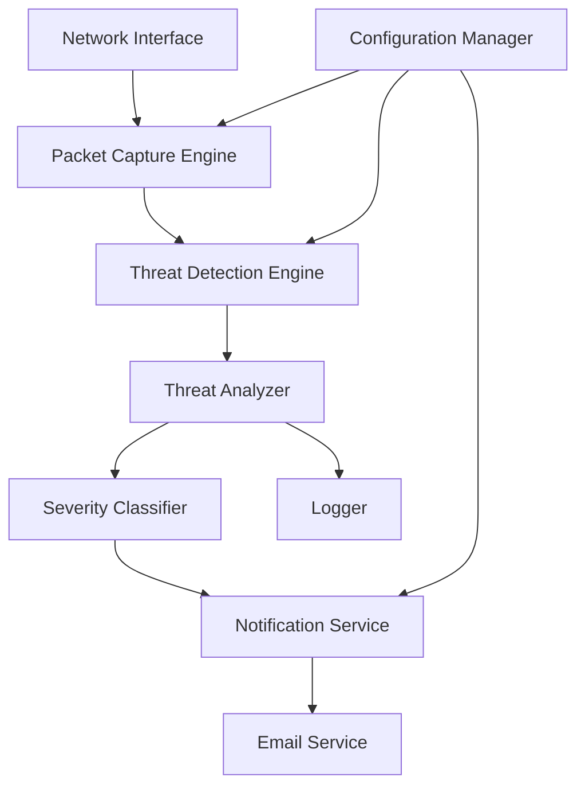

# Intrusion Detection System - Design Document

## Overview

The Intrusion Detection System (IDS) is a Python-based application that monitors network traffic and system activities to detect security threats in real-time. The system uses packet capture libraries (Scapy) for network analysis, pattern matching for threat detection, and SMTP for email notifications. The architecture follows a modular design with clear separation between detection, analysis, notification, and logging components.

## Architecture

### High-Level Architecture



### Component Architecture

The system is organized into the following layers:

1. **Capture Layer**: Captures network packets and system events
2. **Detection Layer**: Analyzes captured data for threat patterns
3. **Analysis Layer**: Classifies threats and assigns severity
4. **Notification Layer**: Sends alerts via email
5. **Persistence Layer**: Logs events and maintains audit trail

## Components and Interfaces

### 1. Packet Capture Engine

**Responsibility**: Capture network packets from specified interfaces

**Key Classes**:
- `PacketCaptureEngine`: Main class for packet capture
  - `start_capture(interface: str) -> None`: Begin packet capture
  - `stop_capture() -> None`: Stop packet capture
  - `get_packet_stream() -> Iterator[Packet]`: Stream captured packets

**Dependencies**: Scapy library for packet capture

**Implementation Notes**:
- Uses Scapy's `sniff()` function with callback mechanism
- Runs in separate thread to avoid blocking main application
- Filters can be applied to reduce processing overhead

### 2. Threat Detection Engine

**Responsibility**: Analyze packets and identify potential threats

**Key Classes**:
- `ThreatDetectionEngine`: Orchestrates detection modules
  - `analyze_packet(packet: Packet) -> Optional[ThreatEvent]`: Analyze single packet
  - `register_detector(detector: ThreatDetector) -> None`: Add detection module

- `ThreatDetector` (Abstract Base Class): Base for specific detectors
  - `detect(packet: Packet) -> Optional[ThreatEvent]`: Detection logic

**Detector Implementations**:
- `PortScanDetector`: Detects TCP/UDP port scanning (SYN scans, connect scans)
- `ICMPScanDetector`: Detects ICMP ping sweeps and scans
- `MalwareDetector`: Detects suspicious payloads and known malware signatures
- `BruteForceDetector`: Detects repeated authentication failures
- `AttackerIdentifier`: Identifies suspicious IP addresses based on behavior patterns
- `DataExfiltrationDetector`: Detects unusual outbound data transfers

**Detection Techniques**:
- **Port Scan Detection**: Track SYN packets without ACK responses, multiple ports from single source
- **ICMP Scan Detection**: Monitor ICMP echo requests to multiple hosts in short timeframe
- **Malware Detection**: Signature-based detection using YARA rules or pattern matching
- **Brute Force Detection**: Track failed authentication attempts per source IP
- **Attacker Identification**: Behavioral analysis based on multiple threat indicators
- **Data Exfiltration**: Monitor outbound traffic volume and destination patterns

### 3. Threat Analyzer

**Responsibility**: Classify threats and generate detailed analysis

**Key Classes**:
- `ThreatAnalyzer`: Analyzes detected threats
  - `analyze(threat_event: ThreatEvent) -> ThreatAnalysis`: Generate analysis
  - `get_recommendations(threat_type: ThreatType) -> List[str]`: Get remediation steps

**Key Data Structures**:
```python
class ThreatEvent:
    timestamp: datetime
    threat_type: ThreatType
    source_ip: str
    destination_ip: str
    protocol: str
    raw_data: dict
    
class ThreatAnalysis:
    threat_event: ThreatEvent
    severity: SeverityLevel
    classification: str
    description: str
    recommendations: List[str]
    justification: str
```

### 4. Severity Classifier

**Responsibility**: Assign severity levels to detected threats

**Key Classes**:
- `SeverityClassifier`: Determines threat severity
  - `classify(threat_event: ThreatEvent, context: ThreatContext) -> SeverityLevel`: Assign severity

**Severity Levels**:
- **Critical**: Active exploitation, malware execution, successful data exfiltration
- **High**: Port scans from known malicious IPs, multiple attack vectors from same source
- **Medium**: Single port scan, ICMP scan, failed brute force attempts
- **Low**: Anomalous but not immediately threatening behavior

**Classification Logic**:
- Base severity assigned by threat type
- Escalation based on frequency and source reputation
- Context-aware (time of day, historical patterns)

### 5. Notification Service

**Responsibility**: Manage email notifications and batching

**Key Classes**:
- `NotificationService`: Orchestrates notifications
  - `notify(threat_analysis: ThreatAnalysis) -> bool`: Send notification
  - `batch_notifications(analyses: List[ThreatAnalysis]) -> bool`: Send batched alert

- `EmailService`: Handles email sending
  - `send_email(recipient: str, subject: str, body: str) -> bool`: Send email via SMTP
  - `format_threat_email(analysis: ThreatAnalysis) -> Tuple[str, str]`: Format email content

**Email Template Structure**:
```
Subject: [IDS ALERT - {SEVERITY}] {THREAT_TYPE} Detected

Body:
=== THREAT DETECTED ===
Type: {threat_type}
Severity: {severity}
Timestamp: {timestamp}
Source: {source_ip}
Destination: {destination_ip}

=== ANALYSIS ===
{description}

=== SEVERITY JUSTIFICATION ===
{justification}

=== RECOMMENDED ACTIONS ===
1. {recommendation_1}
2. {recommendation_2}
...

=== TECHNICAL DETAILS ===
{raw_data}
```

**Batching Logic**:
- Collect threats within 5-minute window
- Send single email with multiple threats if count > 3
- Immediate notification for Critical severity

### 6. Configuration Manager

**Responsibility**: Load and manage system configuration

**Key Classes**:
- `ConfigurationManager`: Manages configuration
  - `load_config(path: str) -> Config`: Load from file
  - `get(key: str) -> Any`: Get configuration value
  - `reload() -> None`: Reload configuration

**Configuration File Format** (YAML):
```yaml
email:
  smtp_host: smtp.gmail.com
  smtp_port: 587
  use_tls: true
  username: [email]
  password: [password]
  recipients:
    - [email]

detection:
  network_interface: eth0
  port_scan_threshold: 10  # ports in 60 seconds
  icmp_scan_threshold: 5   # hosts in 30 seconds
  brute_force_threshold: 5 # attempts in 60 seconds
  
logging:
  log_level: INFO
  log_file: ids.log
  max_log_size_mb: 100
  backup_count: 5

notification:
  batch_window_seconds: 300
  batch_threshold: 3
  retry_attempts: 3
  retry_delay_seconds: 10
```

### 7. Logger

**Responsibility**: Log events and maintain audit trail

**Key Classes**:
- `IDSLogger`: Logging interface
  - `log_threat(threat_analysis: ThreatAnalysis) -> None`: Log threat
  - `log_notification(status: str, recipient: str) -> None`: Log notification
  - `log_system_event(event: str) -> None`: Log system events

**Log Format** (JSON):
```json
{
  "timestamp": "2025-10-15T14:30:00Z",
  "event_type": "threat_detected",
  "threat_type": "port_scan",
  "severity": "high",
  "source_ip": "192.168.1.100",
  "destination_ip": "10.0.0.5",
  "details": {...}
}
```

## Data Models

### Core Data Models

```python
from enum import Enum
from dataclasses import dataclass
from datetime import datetime
from typing import List, Dict, Any, Optional

class ThreatType(Enum):
    PORT_SCAN = "port_scan"
    ICMP_SCAN = "icmp_scan"
    MALWARE = "malware"
    BRUTE_FORCE = "brute_force"
    ATTACKER_IDENTIFIED = "attacker_identified"
    DATA_EXFILTRATION = "data_exfiltration"

class SeverityLevel(Enum):
    LOW = "low"
    MEDIUM = "medium"
    HIGH = "high"
    CRITICAL = "critical"

@dataclass
class ThreatEvent:
    timestamp: datetime
    threat_type: ThreatType
    source_ip: str
    destination_ip: Optional[str]
    protocol: str
    raw_data: Dict[str, Any]
    
@dataclass
class ThreatAnalysis:
    threat_event: ThreatEvent
    severity: SeverityLevel
    classification: str
    description: str
    recommendations: List[str]
    justification: str

@dataclass
class Config:
    email_config: Dict[str, Any]
    detection_config: Dict[str, Any]
    logging_config: Dict[str, Any]
    notification_config: Dict[str, Any]
```

## Error Handling

### Error Categories

1. **Network Errors**: Packet capture failures, interface not found
2. **Configuration Errors**: Invalid config file, missing required fields
3. **Email Errors**: SMTP connection failures, authentication errors
4. **Detection Errors**: Malformed packets, parsing errors

### Error Handling Strategy

- **Graceful Degradation**: System continues operating even if one detector fails
- **Retry Logic**: Email sending retries up to 3 times with exponential backoff
- **Fallback Configuration**: Use secure defaults if config is invalid
- **Error Logging**: All errors logged with full context for debugging
- **User Notification**: Critical errors (email service down) logged prominently

### Exception Hierarchy

```python
class IDSException(Exception):
    """Base exception for IDS"""
    pass

class CaptureException(IDSException):
    """Packet capture related errors"""
    pass

class DetectionException(IDSException):
    """Threat detection errors"""
    pass

class NotificationException(IDSException):
    """Email notification errors"""
    pass

class ConfigurationException(IDSException):
    """Configuration errors"""
    pass
```

## Testing Strategy

### Unit Testing

- **Detector Tests**: Test each detector with crafted packets
- **Classifier Tests**: Verify severity assignment logic
- **Email Formatting Tests**: Validate email template generation
- **Configuration Tests**: Test config loading and validation

### Integration Testing

- **End-to-End Flow**: Inject test packets → verify email sent
- **Batching Logic**: Test notification batching behavior
- **Error Recovery**: Test retry logic and fallback mechanisms

### Test Data

- **PCAP Files**: Pre-recorded packet captures for various attack types
- **Mock SMTP Server**: Test email sending without real SMTP
- **Synthetic Threats**: Generate test threats programmatically

### Performance Testing

- **Packet Processing Rate**: Measure packets processed per second
- **Memory Usage**: Monitor memory consumption during extended operation
- **Detection Latency**: Measure time from packet capture to notification

## Security Considerations

1. **Credential Storage**: Email credentials stored in config file (recommend environment variables or secrets manager)
2. **Privilege Requirements**: Packet capture requires root/admin privileges
3. **Log Sanitization**: Ensure logs don't contain sensitive data
4. **Rate Limiting**: Prevent email flooding from excessive detections
5. **Input Validation**: Validate all configuration inputs

## Deployment Considerations

### System Requirements

- **OS**: Linux (recommended), Windows, macOS
- **Python**: 3.8+
- **Privileges**: Root/Administrator for packet capture
- **Network**: Access to monitored interface
- **Dependencies**: Scapy, PyYAML, smtplib (standard library)

### Installation Steps

1. Install Python dependencies
2. Configure network interface permissions
3. Create configuration file
4. Set up email credentials
5. Run as system service (systemd on Linux)

### Running as Service

- **Linux**: systemd service unit
- **Windows**: Windows Service or Task Scheduler
- **Monitoring**: Health check endpoint or log monitoring

## Future Enhancements

1. **Machine Learning**: Anomaly detection using ML models
2. **Web Dashboard**: Real-time threat visualization
3. **Database Storage**: Store threats in database for analysis
4. **Integration**: Webhook support for SIEM integration
5. **Automated Response**: Automatic firewall rule creation
6. **Distributed Deployment**: Multiple sensors reporting to central server
